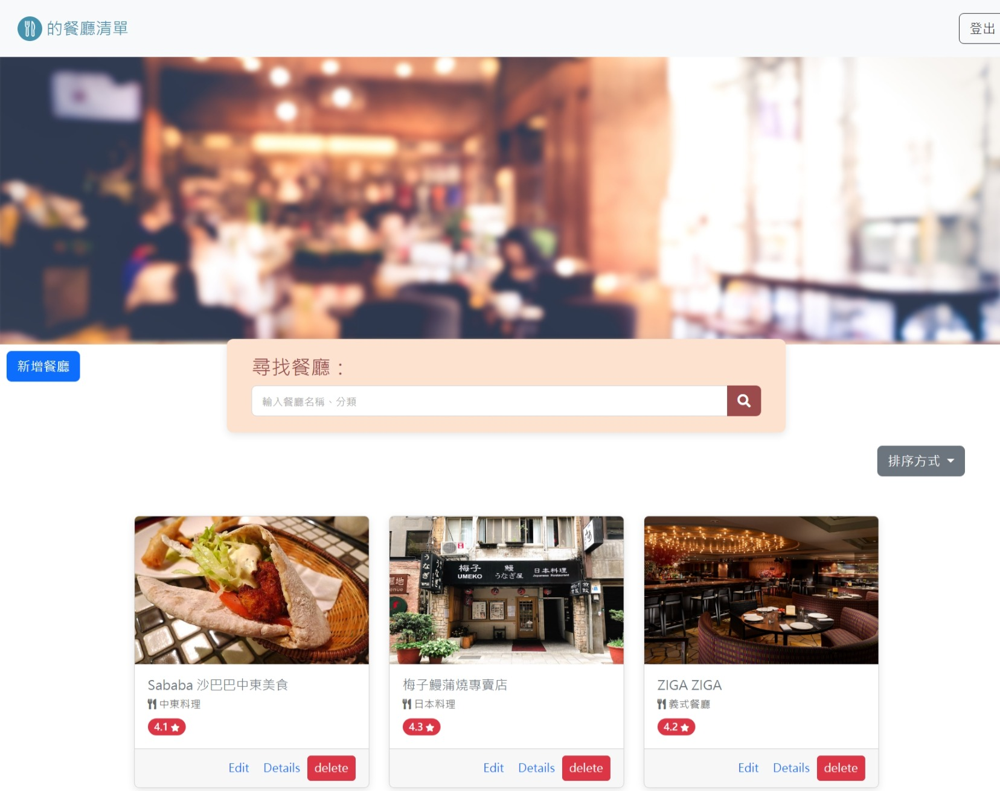

# 我的餐廳清單



## 介紹

紀錄屬於自己的餐廳清單，可以瀏覽餐廳、查看詳細資訊、甚至連結到地圖。

### 功能

- 使用者可以新增一家餐廳
- 使用者可以瀏覽一家餐廳的詳細資訊
- 使用者可以瀏覽全部所有餐廳
- 使用者可以修改一家餐廳的資訊
- 使用者可以刪除一家餐廳
- 使用者可以註冊帳號，註冊的資料包括：名字、email、密碼、確認密碼
- 使用者也可以透過 Facebook Login 直接登入
- 使用者必須登入才能使用餐廳清單，登入後可以建立並管理專屬他的一個餐廳清單
- 使用者登出、註冊失敗、或登入失敗時，使用者都會在畫面上看到正確而清楚的系統訊息

## 開始使用

1. 請先確認有安裝 node.js 與 npm
2. 將專案 clone 到本地
3. 在本地開啟之後，透過終端機進入資料夾，輸入：

   ```bash
   npm install
   ```

4. 安裝完畢後，設定環境變數連線 MongoDB

   ```bash
   MONGODB_URI=mongodb+srv://<Your MongoDB Account>:<Your MongoDB Password>@cluster0.xxxx.xxxx.net/<Your MongoDB Table><?retryWrites=true&w=majority
   ```
5. 執行種子資料：

   ```bash
   npm run seed
   ```
第一位使用者：

- email: user1@example.com
- password: 12345678
- 擁有 #1, #2, #3 號餐廳

第二位使用者：

- email: user2@example.com
- password: 12345678
- 擁有 #4, #5, #6 號餐廳
   
7. 繼續輸入：

   ```bash
   npm run start
   ```

8. 若看見此行訊息則代表順利運行，打開瀏覽器進入到以下網址

   ```bash
   Listening on http://localhost:3000
   ```

9. 若欲暫停使用

   ```bash
   ctrl + c
   ```

## 開發工具

- Node.js 14.16.0
- Express 4.17.1
- Express-Handlebars 4.0.2
- Bootstrap 5.2.1
- Font-awesome 5.8.1
- bcryptjs 2.4.3
- body-parser 1.20.2
- connect-flash 0.1.1
- method-override 3.0.0
- passport 0.4.1
- passport-facebook 3.0.0
- passport-local 1.0.0
  
- MongoDB
- mongoose 5.9.7
